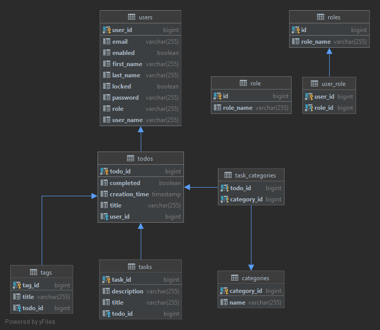

# **TODO APPLICATION**
### This is RESTful application for Appcent challenge.

This application provides a RESTful api. There is no UI except for basic login page. This application is not done yet. It is in progress.

Application ER Model



### **RUN TODO APPLICATION**

```
git clone https://github.com/eemustafasahin/TodoAppAppcent.git
cd TodoAppAppcent
mvn clean install
cd target
java - jar TodoApplication-0.0.1-SNAPSHOT.jar
```
You can then access application http://localhost:8080/

It redirects you login page. You should either login with existing user with the following info:
```
Username: springboot
Password: HelloSpring
```
or send signup post request then login with related info. For example:
```
{
  "firstname": "mustafa",
  "lastname": "sahin",
  "username": "tuzludondurma",
  "password": "password",
  "email": "mustafasahin@gmail.com"
}
```
### **ACCESS APP VIA HEROKU**
You can also access application with default user info:
```
Username: springboot
Password: HelloSpring
```
[appcentherokutodoapp.herokuapp.com](https://appcentherokutodoapp.herokuapp.com/)

### To work with Todo Application

### Prerequisites
```
Maven 3
Git
Java 11
```


### jpa & hibernate
spring.jpa.hibernate.ddl-auto=create-drop
#spring.jpa.show-sql=true
#spring.jpa.properties.hibernate.format_sql=true

### server
#server.servlet.context-path=/api
server.error.include-binding-errors=always
server.error.include-message=always
```

## **Technology Stack**

- Java 11+
- Spring Boot
- Spring Web
- Spring Security
- Spring Data/
- PostgreSQL DB /H2 Database
- Open Api Spec./Swagger
- Maven

# Happy Coding (^_^)


